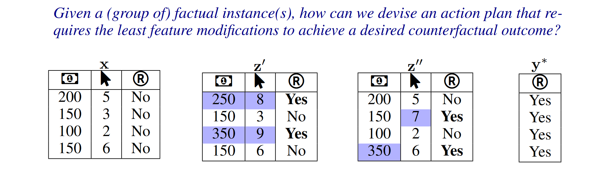
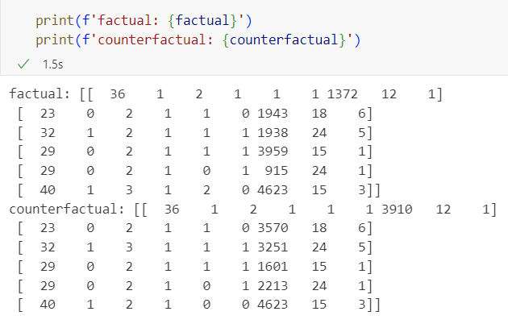
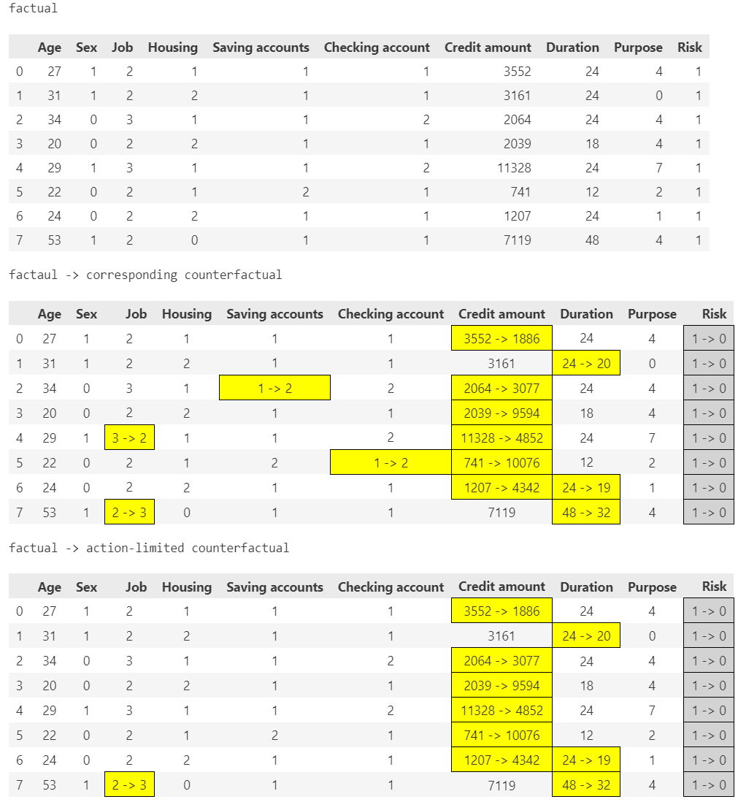
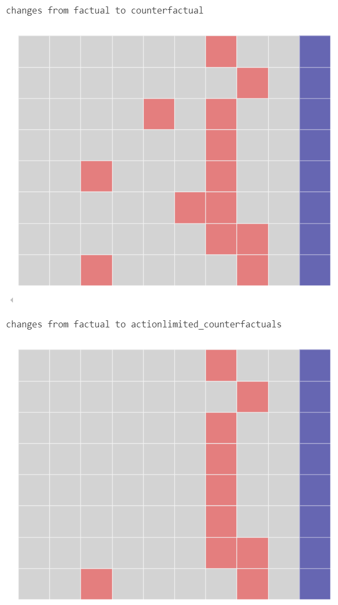
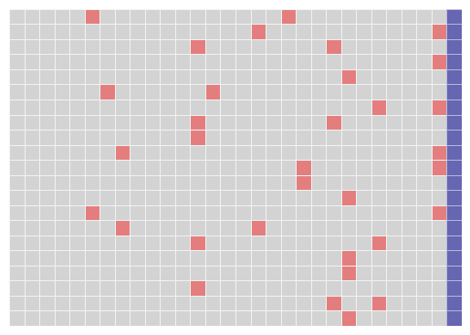
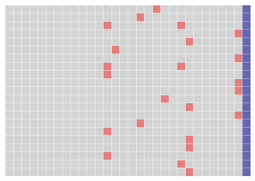

Counterfactual explanations with Limited Actions (COLA)
======================================================================
  
Explainable Artificial Intelligence (XAI) is essential for making artificial intelligence systems transparent and trustworthy (`Arrieta et al., 2020 <https://www.sciencedirect.com/science/article/pii/S1566253519308103?casa_token=tMxtv_87MG0AAAAA:_f_pbOfKiVGSTKWC9mN6dxKyXYuO6FiE4-OWoUubefLcRe6JDOILQlo0aqPtyuEU5j9hoPzv>`_). 
Within this area, feature attributions (FA) methods, such as Shapley values (`Sundararajan & Najmi, 2020 <https://proceedings.mlr.press/v119/sundararajan20b.html>`_; `Lundberg & Lee, 2017 <https://www.planchet.net/EXT/ISFA/1226.nsf/769998e0a65ea348c1257052003eb94f/02b26cfa6ecc8cd3c12583d9006de8c2/$FILE/7062-a-unified-approach-to-interpreting-model-predictions.pdf>`_), determine how much each input feature contributes to a machine learning (ML) model's output. 
This helps simplify complex models by highlighting the most influential features.

Another technique counterfactual explanations (CE) (`Wachter et al., 2017 <https://heinonline.org/HOL/LandingPage?handle=hein.journals/hjlt31&div=29&id=&page=>`_; `Guidotti, 2022 <https://link.springer.com/article/10.1007/s10618-022-00831-6>`_) show how small changes in input features can lead to different outcomes. 
While hundreds of CE algorithms have been proposed (`Guidotti, 2022 <https://link.springer.com/article/10.1007/s10618-022-00831-6>`_) to date, it is hardly practical to find one single CE algorithm that suits for all user cases, due to each of them is tailored particularly for their own different scenarios, goals, and tasks. 
For instance, the objective in one CE algorithm can be defined as finding a single counterfactual instance for each factual instance sometimes, while at othertimes, it could be treating multiple instances as a group and seeking one or more/multiple counterfactual instances for each factual observation. 
In some cases, the focus of a CE algorithm could be on theentire dataset, aiming to identify global CE that indicate the direction to move the factual instances to achieve the desired model output (`Rawal & Lakkaraju, 2020 <https://proceedings.neurips.cc/paper/2020/hash/8ee7730e97c67473a424ccfeff49ab20-Abstract.html>`_; `Ley et al., 2022 <https://arxiv.org/abs/2204.06917>`_; `Carrizosa et al., 2024 <https://www.sciencedirect.com/science/article/pii/S037722172400002X>`_). 
Yet in other scenarios, the group of factual instances is viewed as a distribution, aiming to find a counterfactual distribution that remains similar in shape to the factual distribution (`You et al., 2024 <https://arxiv.org/pdf/2401.13112>`_), 
and ensuring comparable costs. Besides, some CE algorithms assume differentiable models, whereas others are designed specifically for tree-based or ensemble models.

What is COLA?
----------------------------

COLA adapts to various CE methods and ML models. Extensive simulations show that the framework produces action plans that require significantly fewer feature changes to achieve outcomes similar (or sometimes equal) to those generated by various CE algorithms. Especially, COLA is shown to have near-optimal performance under certain circumstances.

START COLA!
-------------------------
COLA is a python package that helps refine the results of generated counterfactual explanations. We also provide built-in counterfactual algorithms like `DiCE <https://github.com/interpretml/DiCE?tab=readme-ov-file>`_, `DisCount <https://arxiv.org/pdf/2401.13112>`_, `Alibi_CI <https://docs.seldon.io/projects/alibi/en/latest/methods/CF.html>`_
and built-in dataset for testing such as GermanCredit, HotelBooking etc.

Do the following steps to start refining: 
1.Initilize the data interface
2.Initilize the model interface
3.Generate counterfactual explanations
4.Refine the counterfactual explanations
5.Visualize results

Part1: Initilize the data interface
-COLA can accept two kinds of data: PandasData and NumpyData.
-If you don't have your personal dataset, you can use the built-in test_dataset.
.. code:: python
    from xai_cola import data_interface 
    from xai_cola import ml_model_interface
    from counterfactual_explainer import DiCE
    from xai_cola.counterfactual_limited_actions import COLA

    # Use the built-in test_dataset
    from test_dataset.german_credit import GermanCreditDataset
    dataset = GermanCreditDataset()
    df = dataset.get_dataframe()

    # pick 8 samples with Risk = 1, because we want to generate counterfactuals make Risk from 1 to 0
    df_Risk_1 = df[df['Risk'] == 1]
    df_Risk_1 = df_Risk_1.sample(8)

    # drop the target column.
    # Normally, the input data doesn't contain the target column
    df_without_target = df_Risk_1.drop(columns=['Risk']).copy()
    feature_names = df_without_target.columns

    # Initialize the data interface
    data = data_interface.PandasData(df_without_target, target_name='Risk')

Part2: Initilize the model interface
-COLA can accept two kinds of model: sklearn model and pytorch model.
-For the GermanCredit dataset, we provide a pre-trained model(lgbm_GermanCredit.pkl).
.. code:: python
    # download the pre-trained model    
    import joblib
    lgbmcClassifier = joblib.load('lgbm_GremanCredit.pkl')

    # Initialize the model interface
    ml_model = ml_model_interface.Model(model=lgbmcClassifier, backend="sklearn")

Part3: Generate counterfactual explanations
-You can choose DiCE, DisCount, Alibi_CI as the counterfactual explainer.
-Or You can use your own explainer
.. code:: python
    # choose the explainer
    explainer = DiCE(ml_model=ml_model)

    # gerenate counterfactual explanations
    factual, counterfactual = explainer.generate_counterfactuals(data=data,
                                                             factual_class=1,
                                                             total_cfs=1,
                                                             features_to_keep=['Age','Sex'])

Part4: Refine the counterfactual explanations
-You should Initialize the COLA, choose the policy and number of actions.
-If you use your own explainer, you just need to input the numpy array type x_factual and x_counterfactual.

.. code:: python
    # Initialize the COLA
    refiner = COLA(
            data=data,
            ml_model=ml_model,
            x_factual=factual,
            x_counterfactual=counterfactual,
            )

    # Choose the policy
    refiner.set_policy(
            matcher="ect", # We prefer "ect_matcher" with DiCE, you can also choose "ot_matcher" for group-based counterfactuals
            attributor="pshap",
            Avalues_method="max"
            )

    # Choose the number of actions
    factual, ce, ace = refiner.get_refined_counterfactual(limited_actions=7)

Part5: Visualize results
-For small number of instances, you can use the highlight_changes() to highlight get_dataframe
-For massive dataset, suggest to use the heatmap() to visualize the changes
.. code:: python
    # Highlight the changes
    rrefine_factual, refine_ce, refine_ace = refiner.highlight_changes()
    print("factual")
    display(factual)
    print("factaul -> corresponding counterfactual")
    display(refine_ce)
    print("factual -> action-limited counterfactual")
    display(refine_ace)

    # Heatmap
    refiner.heatmap()

If dataset has large number of instances, or too many features, it's nice to show the heatmap. For example, the heatmap of the HotelBooking dataset is shown below.

Future work
-------
This work still needs to be supplemented and improved. Our future work plan is as follows:

* Can be compatible with more counterfactual algorithms like DiCE and DisCount.
* Explore more visualization (such as in feature attribution).
* Explore more diverse refine methods (based on different user needs).
* Pay more attention to the fairness of counterfactual explanations.

Citing
-------
The theoretical foundation of COLA is described in the following paper:

Lei You, Yijun Bian, and Lele Cao (2024). `Refining Counterfactual Explanations With Joint-Distribution-Informed Shapley Towards Actionable Minimality <https://arxiv.org/pdf/2410.05419>`_.

Contributing
------------
This project welcomes contributions and suggestions. If you have some questions about it, please feel free to reach out.

* Lin Zhu (s232291@dtu.dk)
* Lei You (leiyo@dtu.dk)