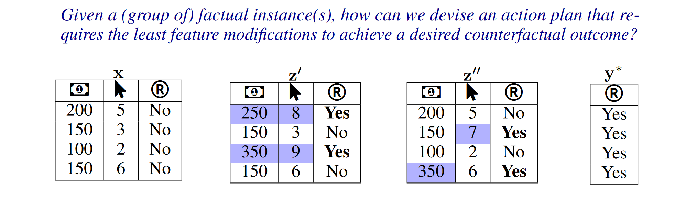

==================
COLA Documentation
==================

.. image:: https://img.shields.io/badge/arXiv-2410.05419-B31B1B.svg
   :target: https://arxiv.org/pdf/2410.05419
   :alt: arXiv

.. image:: https://img.shields.io/badge/License-MIT-blue.svg
   :target: https://opensource.org/licenses/MIT
   :alt: MIT License

.. image:: https://img.shields.io/pypi/v/xai-cola.svg
   :target: https://pypi.org/project/xai-cola/
   :alt: PyPI version

.. image:: https://img.shields.io/badge/python-3.9+-blue.svg
   :target: https://www.python.org/downloads/
   :alt: Python 3.9+

Welcome to COLA
===============

**COLA** (COunterfactual explanations with Limited Actions) is a Python framework that refines counterfactual explanations by generating action-limited plans that require significantly fewer feature changes while maintaining similar or equal outcomes.

Why COLA?
=========

Traditional counterfactual explainers often produce explanations that require changing many features. COLA refines these explanations to be more actionable:

- ✅ **30-50% fewer actions** compared to raw counterfactuals
- ✅ **Works with different ML models** (sklearn, PyTorch)
- ✅ **Built-in Counterfactual explainers** (DiCE, DisCount)
- ✅ **Compatible with all generated counterfactuals** (in DataFrame format)
- ✅ **Theoretically grounded** - based on joint-distribution-informed Shapley values (see our `paper <https://arxiv.org/pdf/2410.05419>`_)
- ✅ **Easy to use** - simple API with sensible defaults
- ✅ **Rich visualizations** - heatmaps, charts, highlighted tables

Quick Example
=============

.. code-block:: python

    from xai_cola import COLA
    from xai_cola.ce_sparsifier.data import COLAData
    from xai_cola.ce_sparsifier.models import Model
    from xai_cola.ce_generator import DiCE

    # 1. Prepare data
    data = COLAData(factual_data=df, label_column='Risk')

    # 2. Wrap model
    ml_model = Model(model=your_model, backend="sklearn")

    # 3. Generate counterfactuals with any explainer
    explainer = DiCE(ml_model=ml_model)
    _, cf = explainer.generate_counterfactuals(data=data, factual_class=1)
    data.add_counterfactuals(cf, with_target_column=True)

    # 4. Refine with COLA
    sparsifier = COLA(data=data, ml_model=ml_model)
    sparsifier.set_policy(matcher='ot', attributor='pshap')
    refined = sparsifier.refine_counterfactuals(limited_actions=5)

    # 5. Visualize
    sparsifier.heatmap_direction(save_path='./results')
    sparsifier.stacked_bar_chart(save_path='./results')

Installation
============

Install via pip:

.. code-block:: bash

    pip install xai-cola

See :doc:`installation` for detailed instructions.

Documentation Structure
=======================

This documentation is organized into several sections:

**Getting Started** 📚
   New to COLA? Start here!

   - :doc:`installation` - Install COLA
   - :doc:`quickstart` - 5-minute quick start
   - :doc:`tutorials/01_basic_tutorial` - Complete tutorial

**User Guide** 📖
   Learn how to use COLA's features.

   - :doc:`user_guide/data_interface` - Managing data
   - :doc:`user_guide/models` - Wrapping ML models
   - :doc:`user_guide/explainers` - Generating counterfactuals
   - :doc:`user_guide/matching_policies` - Refinement strategies
   - :doc:`user_guide/visualization` - Visualizing results

**API Reference** 🔍
   Detailed API documentation.

   - :doc:`api/cola` - COLA main class
   - :doc:`api/data` - Data interface
   - :doc:`api/models` - Model interface
   - :doc:`api/ce_generator` - CF generators
   - :doc:`api/policies` - Matching & attribution
   - :doc:`api/visualization` - Visualization tools

**Additional Resources** 💡
   FAQs, contributing, and more.

   - :doc:`faq` - Frequently asked questions
   - :doc:`contributing` - Contribution guidelines
   - :doc:`changelog` - Version history

.. toctree::
   :maxdepth: 2
   :caption: Getting Started

   installation
   quickstart
   tutorials/01_basic_tutorial

.. toctree::
   :maxdepth: 2
   :caption: User Guide

   user_guide/data_interface
   user_guide/models
   user_guide/explainers
   user_guide/matching_policies
   user_guide/visualization

.. toctree::
   :maxdepth: 2
   :caption: API Reference

   api/cola
   api/data
   api/models
   api/ce_generator
   api/policies
   api/visualization

.. toctree::
   :maxdepth: 1
   :caption: Additional Resources

   faq
   contributing
   changelog

Key Features
============

Flexible Data Interface
-----------------------

Works with both pandas DataFrames and NumPy arrays:

.. code-block:: python

    # With DataFrame
    data = COLAData(factual_data=df, label_column='target')

    # With NumPy
    data = COLAData(
        factual_data=X,
        label_column='target',
        column_names=['feat1', 'feat2', 'target']
    )

Multi-Framework Support
-----------------------

Compatible with major ML frameworks:

.. code-block:: python

    # Scikit-learn
    model = Model(sklearn_model, backend="sklearn")

    # PyTorch
    model = Model(pytorch_model, backend="pytorch")

    # TensorFlow
    model = Model(keras_model, backend="TF2")

Multiple Matching Strategies
-----------------------------

Choose the right strategy for your needs:

.. code-block:: python

    # Optimal Transport - best quality
    sparsifier.set_policy(matcher="ot", attributor="pshap")

    # Exact Class Transition - fast
    sparsifier.set_policy(matcher="ect", attributor="pshap")

    # Nearest Neighbor - simplest
    sparsifier.set_policy(matcher="nn", attributor="pshap")

Rich Visualizations
-------------------

Multiple visualization options:

.. code-block:: python

    # Direction heatmap
    sparsifier.heatmap_direction(save_path='./results')

    # Stacked bar chart
    sparsifier.stacked_bar_chart(save_path='./results')

    # Highlighted DataFrames
    _, ce_style, ace_style = sparsifier.highlight_changes_final()
    display(ce_style)

Use Cases
=========

Credit Approval
---------------

**Scenario:** A loan applicant is rejected. What's the minimal change needed?

**Without COLA:** Change 8 features (income, duration, job, age, housing, ...)

**With COLA:** Change 3 features (income, duration, job)

Medical Diagnosis
-----------------

**Scenario:** Patient classified as high-risk. What tests should change?

**Without COLA:** Modify 12 biomarkers

**With COLA:** Focus on 4 key biomarkers

Hiring Decisions
----------------

**Scenario:** Candidate not selected. What qualifications matter most?

**Without COLA:** Improve 10 different areas

**With COLA:** Focus on 3 specific skills

Research & Citation
===================

If you use COLA in your research, please cite:

.. code-block:: bibtex

    @article{you2024refining,
      title={Refining Counterfactual Explanations With Joint-Distribution-Informed
             Shapley Towards Actionable Minimality},
      author={You, Lei and Bian, Yijun and Cao, Lele},
      journal={arXiv preprint arXiv:2410.05419},
      year={2024}
    }

**Paper:** `arXiv:2410.05419 <https://arxiv.org/pdf/2410.05419>`_

Community & Support
===================

- **GitHub:** https://github.com/understanding-ml/COLA
- **Issues:** https://github.com/understanding-ml/COLA/issues
- **PyPI:** https://pypi.org/project/xai-cola/
- **Email:** leiyo@dtu.dk, s232291@dtu.dk

Contributing
============

We welcome contributions! See :doc:`contributing` for guidelines.

License
=======

COLA is licensed under the MIT License. See the `LICENSE <https://github.com/understanding-ml/COLA/blob/main/LICENSE>`_ file for details.

Indices and Tables
==================

* :ref:`genindex`
* :ref:`modindex`
* :ref:`search`
