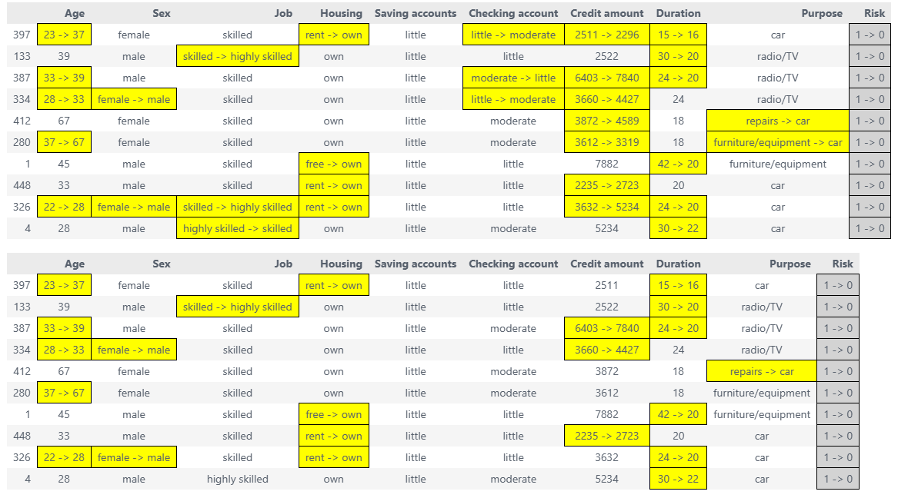
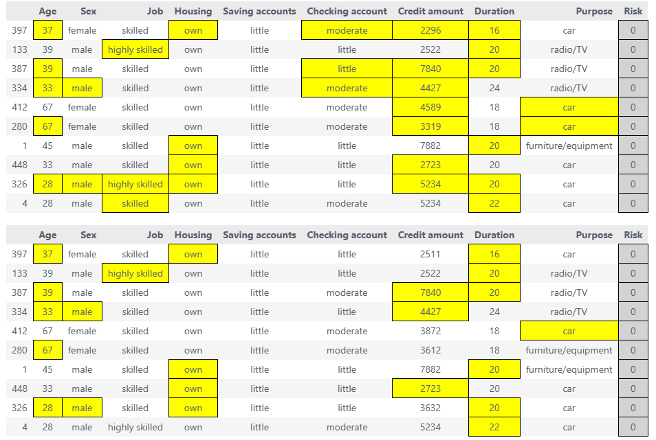
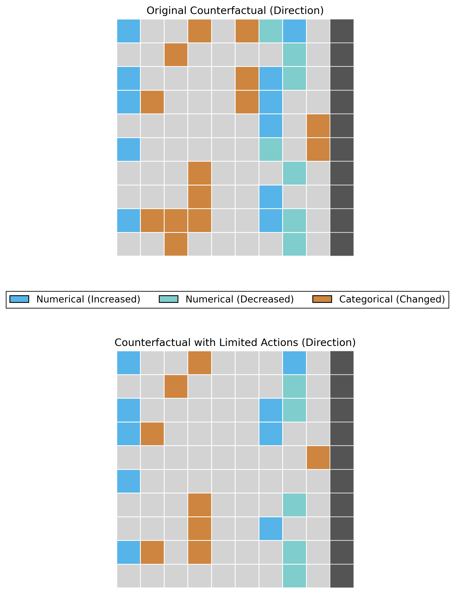
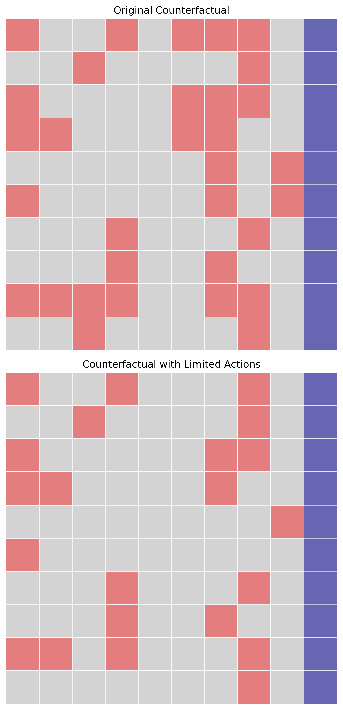
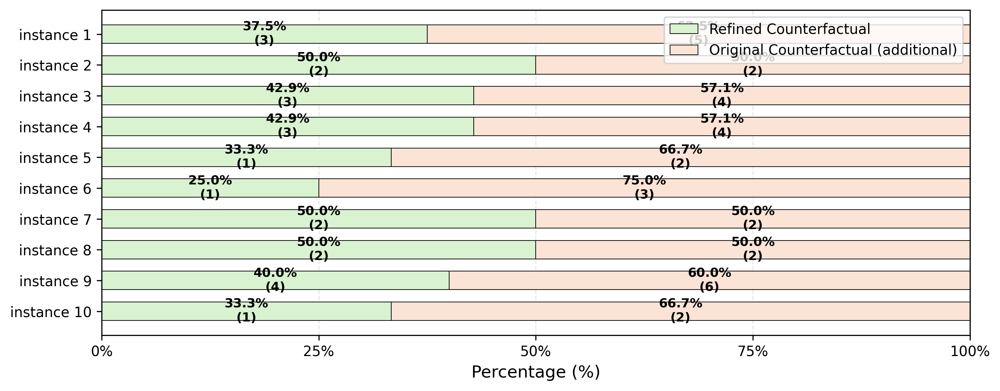
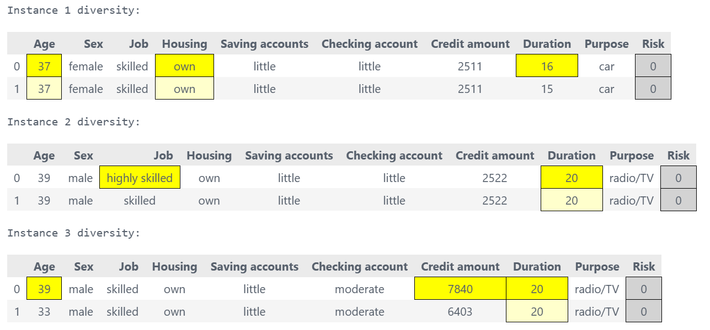

==============
Visualization
==============

Overview
========

COLA provides rich visualization tools to help you understand and communicate counterfactual refinement results. These visualizations show:

- Which features were changed
- How features were changed (increase/decrease)
- How many actions are required
- Diversity of counterfactual options

Available Visualizations
========================

COLA offers five main visualization types:

1. **Highlighted DataFrames** - Side-by-side comparison with color highlighting
2. **Direction Heatmap** - Show which features increase/decrease
3. **Binary Heatmap** - Show which features changed
4. **Stacked Bar Chart** - Compare action counts before/after refinement
5. **Diversity Analysis** - Explore alternative minimal feature combinations

Quick Start
===========

.. code-block:: python

    from xai_cola import COLA
    from xai_cola.ce_sparsifier.data import COLAData
    from xai_cola.ce_sparsifier.models import Model

    # Setup and refine
    sparsifier = COLA(data=data, ml_model=ml_model)
    sparsifier.set_policy(matcher="ot", attributor="pshap")
    refined = sparsifier.refine_counterfactuals(limited_actions=5)

    # Visualize!
    sparsifier.heatmap_direction(save_path='./results')
    sparsifier.stacked_bar_chart(save_path='./results')

1. Highlighted DataFrames
=========================

Show factual and counterfactual data side-by-side with color-coded changes.

Highlight changes comparison
-------------------------------------

Compare factual, original CF, and refined ACE:

.. code-block:: python

    # Get highlighted DataFrames
    factual_style, ce_style, ace_style = sparsifier.highlight_changes_comparison()

    # Display in Jupyter
    display(factual_style, ce_style, ace_style) # display the highlighted dataframes

    # Save to HTML
    ce_style.to_html('original_cf.html')
    ace_style.to_html('refined_ace.html')

Highlight changes final
---------------------------

Compare factual, original CF, and refined ACE:

.. code-block:: python

    # Get highlighted DataFrames
    factual_style, ce_style, ace_style = sparsifier.highlight_changes_final()

    # Display in Jupyter
    display(factual_style)  # Original data
    display(ce_style)       # Original counterfactual (more changes)
    display(ace_style)      # Refined counterfactual (fewer changes)

    # Save to HTML
    ce_style.to_html('original_cf.html')
    ace_style.to_html('refined_ace.html')

**When to use:**

- Presenting to stakeholders
- Detailed instance-by-instance analysis
- Generating reports

2. Direction Heatmap
====================

Visualize the direction of feature changes (increase vs decrease) across instances.

Basic Usage
-----------

.. code-block:: python

    # Generate direction heatmap
    fig = sparsifier.heatmap_direction(
        save_path='./results',
        save_mode='combined',      # 'combined', 'separate'
        show_axis_labels=True,     # Show feature and instance names
        figsize=(12, 8)
    )

**Color coding:**

- ⬜ **Gray** - Value of factual data
- ⬛ **Black** - Label column flip (class transition)
- 🟦 **Blue (#56B4E9)** - Numerical feature increased
- 🟢 **Cyan (#7FCDCD)** - Numerical feature decreased
- 🟧 **Peru (#CD853F)** - Categorical feature changed

Save Modes
----------

**Combined mode** - CE and ACE side by side:

.. code-block:: python

    fig = sparsifier.heatmap_direction(
        save_path='./results',
        save_mode='combined'  # Default
    )

**Separate mode** - Two separate heatmaps:

.. code-block:: python

    fig = sparsifier.heatmap_direction(
        save_path='./results',
        save_mode='separate'
    )
    # Creates: heatmap_direction_counterfactual.png
    #          heatmap_direction_counterfactual_with_limited_actions.png

**When to use:**

- Understanding feature change patterns
- Identifying which features typically increase/decrease
- Comparing CE vs ACE visually

3. Binary Heatmap
=================

Show which features changed (binary: changed or not changed).

Basic Usage
-----------

.. code-block:: python

    # Generate binary heatmap
    fig = sparsifier.heatmap_binary(
        save_path='./results',
        save_mode='combined'
    )

**Color coding:**

- ⬜ **Gray** - Value of factual data
- 🟣 **Purple** - Label column flip (class transition)
- 🔴 **Red** - Feature changed

**When to use:**

- Focusing on which features changed, not how
- Counting total feature changes
- Simple visual comparison

4. Stacked Bar Chart
====================

Compare the number of feature changes before and after sparsification.

Basic Usage
-----------

.. code-block:: python

    # Generate stacked bar chart
    fig = sparsifier.stacked_bar_chart(
        save_path='./results',
        figsize=(14, 6)
    )

**What it shows:**

- **Y-axis (rows)**: Each factual instance - one row per instance
- **X-axis (horizontal bars)**: Percentage or count of feature changes needed to flip the label column relative to factual data
- **Colors**:

  - **Green bar**: Number of features modified in refined (sparsified) counterfactuals
  - **Orange bar**: Number of features modified in original counterfactuals

- Each row displays two horizontal bars (green + orange) representing the comparison between refined ACE and original CF
- **Key insight**: The chart clearly demonstrates that for almost every instance, the green bars (refined counterfactuals) are significantly shorter than orange bars (original counterfactuals), showing that COLA's sparsification requires fewer feature changes to achieve the same label-flipping outcome 

**When to use:**

- Demonstrating COLA's sparsification effectiveness
- Showing the reduction in required feature changes after refinement
- Comparing original counterfactuals vs. refined counterfactuals
- Presentations and papers

5. Diversity Analysis
=====================

Explore alternative minimal feature combinations for achieving the same outcome.

**Core Logic:**

After COLA refines counterfactuals and significantly reduces the number of feature changes, diversity analysis uses an exhaustive enumeration approach to:

1. Find all possible minimal feature combinations that can flip the label column
2. Ensure true minimality: if changing one feature alone can flip the label, no additional features are explored in combination with it
3. Present multiple alternative paths to achieve the same outcome with minimal changes

This provides users with a diverse set of actionable options, each requiring the smallest possible number of feature modifications.

Basic Usage
-----------

.. code-block:: python

    factual_df, diversity_styles = sparsifier.diversity()
    for i, style in enumerate(diversity_styles):
        print(f"Instance {i+1} diversity:")
        display(style)

**What it shows:**

For each instance, shows multiple alternative minimal feature combinations that achieve the desired label flip:

- Each alternative represents a different set of features to modify
- All alternatives use the minimum number of features necessary
- No redundant feature combinations (e.g., if changing feature A alone works, combinations like A+B are excluded)
- Provides actionable choices for users to select the most feasible path

Common Issues
=============

Issue 1: Figures Too Small
---------------------------

**Problem:** Text is unreadable in saved figures.

**Solution:** Increase figsize and DPI:

.. code-block:: python

    # ❌ Too small
    fig = sparsifier.heatmap_direction(figsize=(6, 4))

    # ✅ Better
    fig = sparsifier.heatmap_direction(figsize=(16, 10), dpi=300)

Issue 2: Colors Not Showing
----------------------------

**Problem:** Heatmap appears all white.

**Cause:** No features changed.

**Solution:** Check if refinement actually changed anything:

.. code-block:: python

    factual_df, ce_df, ace_df = sparsifier.get_all_results(limited_actions=5)

    # Count changes
    changes = (factual_df != ace_df).sum().sum()
    print(f"Total feature changes: {changes}")

    if changes == 0:
        print("No changes - increase limited_actions")

Issue 3: HTML Not Displaying
-----------------------------

**Problem:** HTML files don't show styling.

**Solution:** Use ``display()`` in Jupyter or open HTML directly in browser:

.. code-block:: python

    # In Jupyter
    from IPython.display import display
    display(styled_df)

    # Or save and open in browser
    styled_df.to_html('results.html')
    # Then open results.html in Chrome/Firefox

Issue 4: Memory Error with Large Datasets
------------------------------------------

**Problem:** OutOfMemoryError when generating visualizations.

**Solution:** Visualize a subset:

.. code-block:: python

    # Get results
    factual_df, ce_df, ace_df = sparsifier.get_all_results(limited_actions=5)

    # Visualize first 50 instances
    from xai_cola.ce_sparsifier.visualization import generate_direction_heatmap

    fig = generate_direction_heatmap(
        factual_df=factual_df.head(50),
        cf_df=ce_df.head(50),
        ace_df=ace_df.head(50),
        label_column='Risk',
        save_path='./results'
    )

Best Practices
==============

✅ **DO:**

1. **Generate multiple visualization types** for comprehensive understanding

   .. code-block:: python

       # Show different aspects
       sparsifier.heatmap_direction(save_path='./results')  # How
       sparsifier.stacked_bar_chart(save_path='./results')  # How many
       sparsifier.highlight_changes_final()                 # Details

2. **Use appropriate figure sizes** for your medium

   .. code-block:: python

       # Paper: smaller, high DPI
       figsize=(10, 6), dpi=300

       # Presentation: larger, medium DPI
       figsize=(16, 10), dpi=150

       # Web: medium, low DPI
       figsize=(12, 8), dpi=96

3. **Save in multiple formats** for flexibility

   .. code-block:: python

       fig = sparsifier.heatmap_direction(save_path='./results')
       fig.savefig('./results/heatmap.png', dpi=300, bbox_inches='tight')
       fig.savefig('./results/heatmap.pdf', bbox_inches='tight')  # Vector
       fig.savefig('./results/heatmap.svg', bbox_inches='tight')  # Vector

4. **Create a results directory** before saving

   .. code-block:: python

       import os
       os.makedirs('./results', exist_ok=True)

❌ **DON'T:**

1. **Don't forget to refine before visualizing**

   .. code-block:: python

       # ❌ Error - no refinement yet
       sparsifier = COLA(data=data, ml_model=ml_model)
       sparsifier.heatmap_direction()

       # ✅ Correct
       sparsifier.set_policy(matcher="ot", attributor="pshap")
       sparsifier.refine_counterfactuals(limited_actions=5)
       sparsifier.heatmap_direction()

2. **Don't use show_axis_labels=True with many features** - too cluttered

3. **Don't generate huge figures** - stick to reasonable sizes

API Reference
=============

For complete parameter details, see:

- :func:`~xai_cola.ce_sparsifier.visualization.generate_direction_heatmap`
- :func:`~xai_cola.ce_sparsifier.visualization.generate_binary_heatmap`
- :func:`~xai_cola.ce_sparsifier.visualization.generate_stacked_bar_chart`
- :func:`~xai_cola.ce_sparsifier.visualization.highlight_changes_final`
- :func:`~xai_cola.ce_sparsifier.visualization.generate_diversity_for_all_instances`

Next Steps
==========

- Review complete examples in :doc:`../tutorials/01_basic_tutorial`
- See :doc:`matching_policies` for refinement strategies
- Check :doc:`explainers` for CF generation methods
